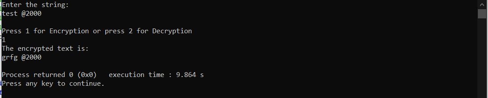
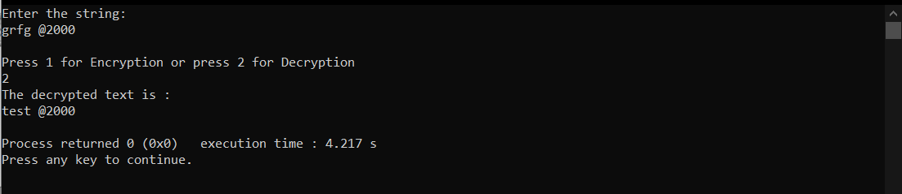

# ROT13.rep
This program converts normal english text to encrypted text format. 
language used to code is C. 

## Instructions:
The program takes the string as input the current limit of input string is 200 characters.

### Image of the output for encryption:

### Image of the output of decryption:

### For more information about the encryption: 

https://en.wikipedia.org/wiki/ROT13
